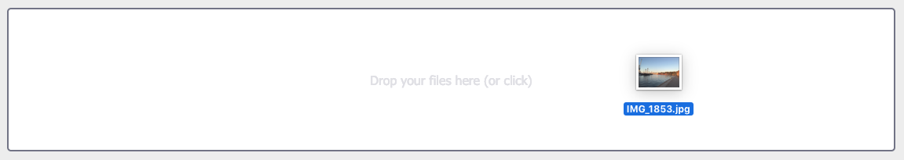

# ngx-dropzone

A lightweight and highly customizable Angular dropzone component for file uploads.

[](https://www.npmjs.com/package/ngx-dropzone) [](https://travis-ci.com/peterfreeman/ngx-dropzone)




## Install

```
$ npm install --save ngx-dropzone
```

## Usage

Import the module

```js
// in app.module.ts
import { BrowserModule } from '@angular/platform-browser';
import { NgModule } from '@angular/core';
import { AppComponent } from './app.component';
import { NgxDropzoneModule } from 'ngx-dropzone';

@NgModule({
  declarations: [
    AppComponent
  ],
  imports: [
    BrowserModule,
    NgxDropzoneModule
  ],
  providers: [],
  bootstrap: [AppComponent]
})
export class AppModule { }
```

## Features of v2

- [ ] Default dropzone with hover effect
- [ ] Make any target a valid dropzone with hover effect via directive
- [ ] Label component
- [ ] Allow multiple files
- [ ] Accept only certain file types
- [ ] Set a max file size
- [ ] FilesChanged, FilesAdded, FilesRejected, FilesRemoved events
- [ ] Support reactive forms (and ngModel?)
- [ ] Image, Video and default preview components
- [ ] Allow inheritance for custom preview components
- [ ] Allow selecting previews
- [ ] Allow removing files
- [ ] Preserve files property
- [ ] Disabled property
- [ ] public method to show file selector
- [ ] public method to reset files
- [ ] Orientation Property to either expand dz container or scroll horizontally
- [ ] Add keyboard interaction

## Licence

MIT © Peter Freeman
